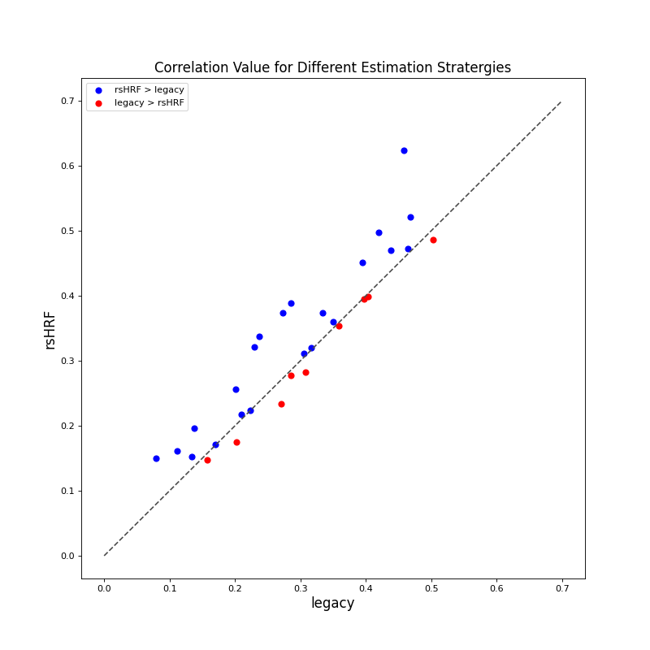

# Analysis: Legacy v/s Retrieved rsHRF

Legacy: https://github.com/BrainModes/fast_tvb <br>
rsHRF Version: https://github.com/AmoghJohri/TVB-Tests/blob/master/main.c

## Dataset

The dataset utilized is present in the *Data* folder. A total of 31 subjects (11 Control Subjects - with prefix *CON* and 20 Patients - with prefix *PAT*) are analyzed. 

From all participants, three types of MRI scans were obtained using a Siemens 3T Magnetom Trio MRI scanner with a 32-channel head coil. First, T1-MPRAGE anatomic images were acquired (160 slices, TR = 1750 ms, TE = 4.18 ms, field of view = 256 mm, flip angle = 9°, voxel size = 1 × 1 × 1 mm, TA = 4:05 min). Next, resting-state functional echo-planar imaging (EPI) data were obtained in an interleaved order (42 slices, TR = 2100 ms, TE = 27 ms, field of view = 192 mm, flip angle = 90°, voxel size = 3 × 3 × 3 mm, TA = 6:24 min). After the first 4 control subjects, 5 meningioma patients, and 2 glioma patients were scanned, the fMRI protocol was accidentally changed to a TR of 2400 ms, resulting in a TA of 7:19 min. This has been taken care of in subsequent analyses by inclusion of an additional covariate. During the fMRI scan, participants were instructed to keep their eyes closed and not fall asleep. Finally, a multishell high-angular resolution diffusion-weighted MRI (DWI) scan was acquired (60 slices; TR = 8700 ms; TE = 110 ms; field of view = 240 mm; 101 diffusion directions; b-values = 0, 700, 1200, 2800 s/mm2; voxel size = 2.5 × 2.5 × 2.5 mm; TA = 15:14 min). In addition, two DWI b = 0 s/mm2 images were collected with reversed phase-encoding blips for the purpose of correcting susceptibility-induced distortions.

High-resolution anatomic images were processed using FreeSurfer (http://surfer.nmr.mgh.harvard.edu) to obtain a subject-specific parcellation of each subject’s brain into 68 cortical regions (34 per hemisphere).

Other relevant details for the same can be found [here](https://www.eneuro.org/content/5/3/ENEURO.0083-18.2018).

For each participant, the following data is provided:
1. **tract_lengths.txt**: distance between pair of regions
2. **weights.txt**: connection strength between pair of regions
3. **FC.mat**: <br>
3.a. **YYYXXT1_ROIts_DK68**: resting-state fMRI time-series for each brain region. <br>
3.b. **FC_cc_DK68**: Empirical functional connectivity matrix (between each pair of brain regions) <br>
3.c. **TR**: BOLD Repetition Time

## Workflow

**Legacy Method**

The *tract_lengths.txt*, *weights.txt* and *param_set.txt* files were used to simulate BOLD time-series with 200 samples using https://github.com/BrainModes/fast_tvb (for each brain region). Using the simulated time-series, the functional connectivity matrix was obtained and the Pearsons' Correlation coeffecient was obtained between the simulated-FC and empirical-FC. This was repeated for 16 different values of *G*, ranging from 0.01 to 3.01, in intervals of 0.2.

**rsHRF Method**

The [rsHRF-toolbox](https://github.com/BIDS-Apps/rsHRF) is used to retrieve the resting-state Hemodynamic Response Function for each brain-region, of each subject, using the corresponding rs-fMRI time-series.

The BOLD simulations are then obtained using the retrieved rsHRF (https://github.com/AmoghJohri/TVB-Tests/blob/master/main.c). Further steps are similar to the above method.

## Reproducing the Experiment

To reproduce the experiment do the following:
1. For the 'legacy' workflow, run `fullTesting_legacy.py`. It uses the input files as mentioned above and the `tvbii_multicore.c` to generate fMRI simulations, obtain the functional connectivity matrix, get the pearsons' correlation coeffecient vs the empirical functional connectivity and store the result in the `./Data/YYYXX/Output/PCorr.txt` file. It does this for all the subjects (11 CON and 20 PAT), for the entire range of *G* values.
2. For the 'rsHRF' method, rsHRF-toolbox (version 1.1.1) should be present ( `pip3 install rsHRF` ). Then, run `fullTesting_fastTvb.py`. The remaining parts are the same as above, except it also stores the values of *J_I* parameter, at the end of 180 seconds of Feedback Inhibhition Control. These values are stored for all the brain regions of every subject, for each value of *G*. This is stored in `./Data/YYYXX/Output/J_i.txt` file.
**Note:** For all the runs, the values get stored in folders with the exact-same path. Hence, to run it in parallel, either conduct each run in separate directories, or make appropriate changes to file-names in the C and python code.

## Result
Please find a more ellaborate analysis of results [here](https://github.com/AmoghJohri/TVB-Tests/blob/master/legacy_vs_rsHRF.ipynb).

Here are a few plots describing the performance of the rsHRF method as compared to the legacy method. The rsHRF method gives a higher correlation for the empirical-simulated FC matrices, for a greater number of participants.




### Organization
```
Data
│   YYYXX (YYY = CON(Control)/PAT(Patients), XX = number)
|   |   FC.mat
│   │   tract_lengths.txt
│   │   weights.txt
|   |   Output_canon2dd
|   |   |   J_i.txt
|   |   └─> PCorr.txt
|   |   Output_fourier
|   |   |   J_i.txt
|   |   └─> PCorr.txt
|   |   Output_gamma
|   |   |   J_i.txt
|   |   └─> PCorr.txt
|   |   Output_legacy
|   └─> └─> PCorr.txt
│   
└───YYYXX 
    │   ...
```

* **PCorr.txt** contains the Pearsons' Correlation value between the simulated functional-connectivity and the empirical functional-connectivity. Each line of the .txt file contains one value corresponding to the correlation obtained for a particular value of *G*. The values (from top-to-bottom) correspond to G = 3.01 to G = 0.01 respectively. <br>
* **J_i.txt** contains the value for Feedback Inhibhition Parameter for each brain-region, corresponding to each value of *G*. This corresponds to the final value obtained after the fitting was performed for 180 seconds.

## Parameters

1. ### DMF Parameters
* a_E = 310
* b_E = 125
* d_E = 0.16
* a_I = 615
* b_I = 177
* d_I = 0.087
* I_0 = 0.382
* w_E = 1.0
* w_I = 0.7
* gamma = 0.0641/1000.0
* tau_E = 100
* tau_I = 10
* gamma_I = 1.0/1000.0
* w_plus = 1.4
* J_NMDA = 0.15
* sigma = 0.01
* tmpJi = 1.0

2. ### Model Parameters
* dt = 0.1 (ms)
* model_dt = 0.001 (s)
* target_FR = 3.0f
* HRF_length = 25

3. ### param_set.txt 
    The following parameters are in order with as provided in the param_set.txt file
* nodes = 68
* G = 0.01 to 3.01 (in intervals of 0.2)
* J_NMDA = 0.150
* w_plys = 1.4
* tmpJi = 1.0
* sigma = 0.01
* total_duration = subject-dependent (to obtain 200 BOLD samples)
* BOLD_TR = subject-dependent
* global_trans_v = 12.5
* rand_num)seed = 1403
* HRF_samples = subject-dependent **#**

4. ### rsHRF-Toolbox Parameters
* estimation = {canon2dd, gamma, fourier}
* passband = [0.01, 0.08]
* TR = subject-dependent
* T0 = 1
* AR_lag = 1
* TD_DD = 2 (for canon2dd)
* order = 3 (for gamma and fourier)
* localK = 2
* thr = 1
* len = 25
* min_onset_search = 4
* max_onset_search = 8